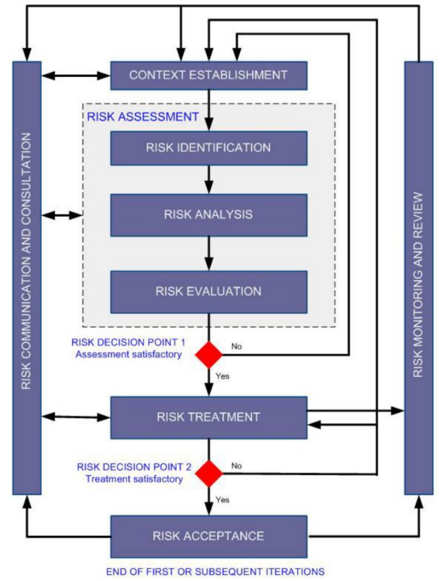
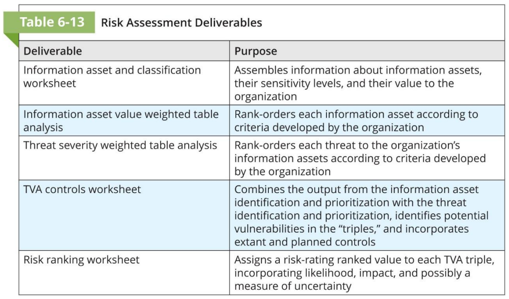
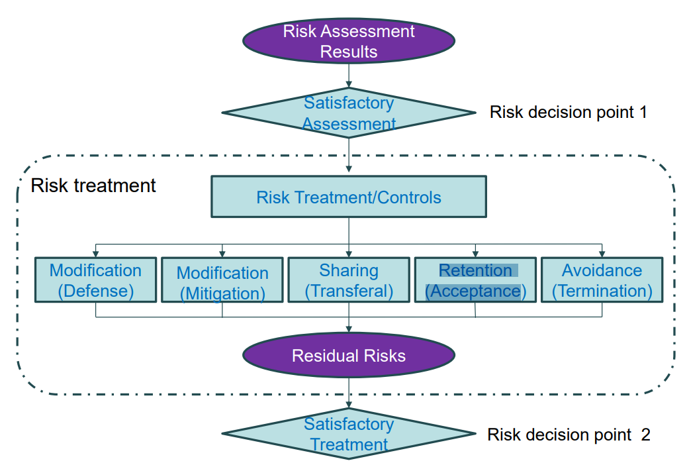
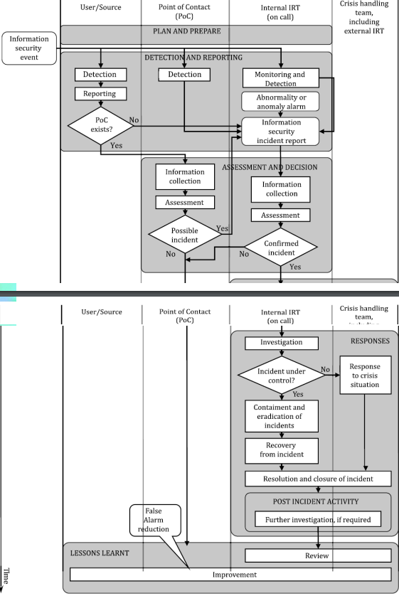
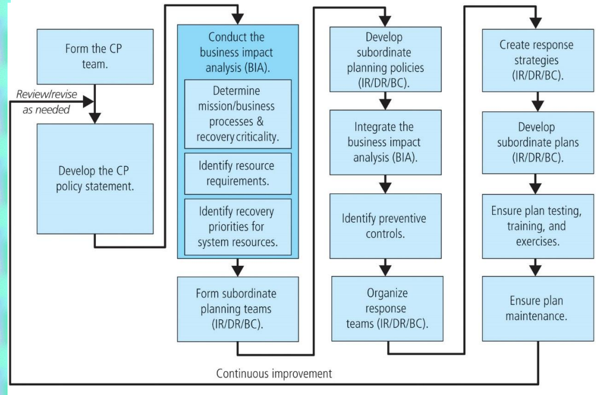
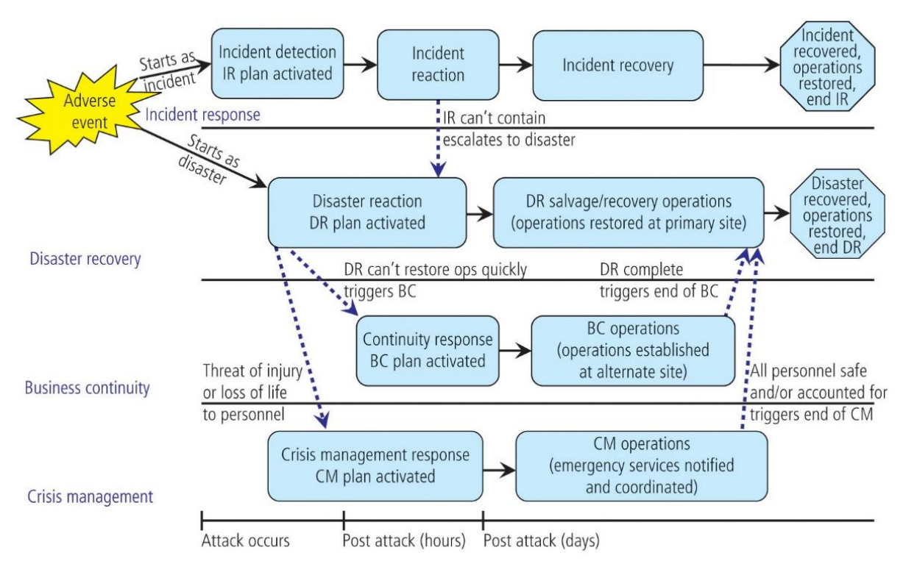
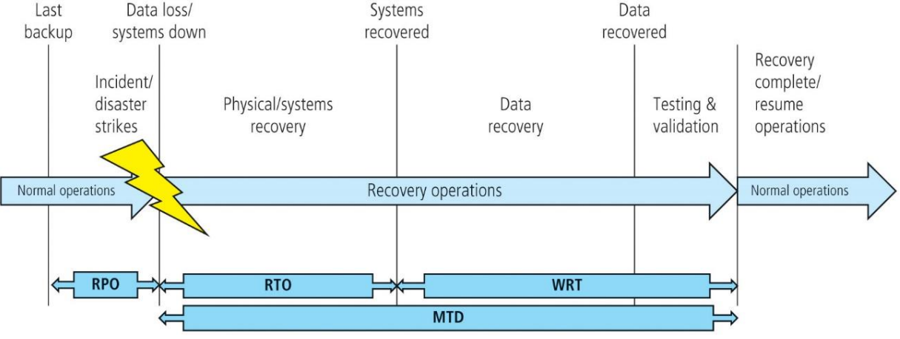
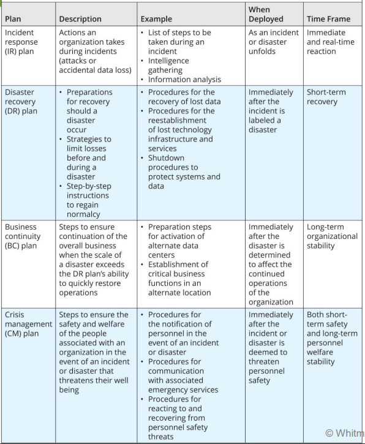

## Terms and Definitions

- **Risk**: The effect of uncertainty on objectives
- **Level of risk:** magnitude of risk or combination of risks, which is the combination of consequences and likelihood
- **Consequence:** is the outcome of the event affecting objectives
- **likelihood:** Is the chance/probability of happening
- **Event:** occurence or change of a particular set of circumstances
- **Incident:** an event that has been assessed as having an actual or potentially adverse effect on the security or performance of a system
- **Risk Criteria:** is the terms of reference which the significance of a risk is evaluated
- **Risk management:** coordinated activities to control an organization with regard to risk
- **Risk management policy:** statement of overall intentions and direction of an organization related to risk management
- **Risk management framework:** set of components that provide the foundations and organizational
arrangements for designing, implementing, monitoring, reviewing and continually improving risk management throughout the organization
- **Risk management plan:** scheme within the risk management framework specifying the approach, the management components and resources to be applied to the management of risk
- **Risk owner:** person or entity with the accountability and authority to manage a risk
- **Risk management process:** systematic application of management policies, procedures and practices to the activities of communicating, consulting, establishing the context, and identifying, analyzing, evaluating, treating, monitoring and reviewing risk
- **Risk analysis:** process to comprehend the nature of risk and determine the level of risk
- **Risk evaluation:** process of comparing the results of risk analysis with the risk criteria to determine whether the risk and/or its magnitude is acceptable or tolerable
- **Risk treatment:** process to modify the risk
- **Control:** the measure that is modifying the risk

## Accountability for Risk management
All communities of interest should be involved in the management of risks:
- InfoSec members best understand the threats and attacks that introduce the risk (They usually take leadership to adress the risk)
- IT members must help to build the secure systems and ensure their safe operation
- Manangement and users play a part in the early detection and response process

**Top mamangement of the organization is resoponsible/accountable for the risk management program**

**StakeHolders:** Person or organization that can affect, be affected by, or perceive themselves to be affected by a decision or activity.

## Risk Management Framework

Stages:
1. Executive governance and support
2. Framework design
3. Framework implementation
4. Framework monitoring and review
5. Continuous improvement

## Risk Management Process

### Establishing the Context

The context is the understanding of the **external and internal environments**, understanding the **RM process** (definded by the framework), understanding the **organizations's risk apetite statement**(will be used for appropriate risk treament):

- Identifying basic requirements of interested parties
- Applying risk assessment (knowing how to)
- Establishing and maintaining information security risk criteria (Qualitive, Quantitive or Hybrid approach)
- Risk acceptance criteria, consequence criteria, likelihood criteria, criteria for determening the level of risk **(Output)**

**Input:** Organization's policy

### Risk Identification (Risk Assessment)

The risk identification process begins with the identification and cataloguing of information assets.
An **information asset** is any asset that collects, stores, processes, or transmits information.

**Threat identification** - process of assessing potential exploitation of weaknesses in each information asset.

Also in this phase, the risk owners are identified.

There are two approaches commonly used to perform risk identification:
- **Event-based approach:** identify strategic scenarios through a consideration of risk sources, and how they use or impact interested parties to reach those risk’s desired objective.
- **Asset-based approach:** identify operational scenarios, which are detailed in terms of assets, threats and vulnerabilities. 

Manager must: 
1. identify the organization’s information assets
2. categorize them into useful groups (Hardware, Software, and Network Assets & People, Procedures, and Data Assets)
3. classify them (Assessing Values for Information Assets using weighting criteria questions)
4. and prioritize them by overall importance (Listing Assets in Order of Importance)

**Input:** Events that can negattively influence the achievement of information security objectives in the organization or in other organizations.

**Output:** a prioritized list of assets & a prioritized list of threats facing those assets which combined together create TVA worksheet(list of risks); a list of risk owners with associated risk

### Risk Analysis (Risk Assessment)

Risk analysis in IS is a process that assigns a comparative risk rating or score to each information vulnerability/asset. (Assessing likelihood, Potential impact on asset value, Percentage of Risk Mitigated by Current Controls)

Techniques for risk analysis based on consequences and likelihood can be:

- qualitative (e.g. high, medium, low)
- quantitative (e.g. monetary cost, frequency or probability of occurrence)
- semiquantitative, using qualitative scales with assigned values

> Risk = likelihood of the occurrence of a vulnerability x the value of the asset - the percentage of risk mitigated by current controls + the uncertainty of current knowledge of the vulnerability. (Whitman Expression)

**Input:** a list of identified relevant event or risk scenarios & lists of all existing controls, their effectiveness, implementation and usage status (Assessing likelihood and consequence)

**Output:** Risk ranking worksheet (A list of risks with level values assigned)

### Risk Evaluation (Risk Assessment)

Apply the risk acceptance criteria to determime whether or not the risks can be accepted. If cannot, they should be prioritized for treatment considering the assessed levels of risks.

**Input:** a list of risk criteria and risks with level values assigned. (Risk ranking worksheet)

**Output:** a list of prioritized risks with scenarios that lead for those risks; whether a risk treatment is required; suggestions for risk management.

### Risk Treatment

Envolves choosing (1 or more) the basic control strategies and plans their implementation:
* **Modification (Defense):** attempts to prevent the exploitation of the vulnerability (Ex: countering threats, removing vulnerabilities in assets, limiting access to assets, and adding protective safeguards)
* **Modification (Mitigation):** attempts to reduce the damage caused by a realized incident or disaster (Incident response (IR) plan, Disaster recovery (DR) plan, Business continuity (BC) plan, Crisis management (CM) plan)
* **Sharing (Transferal):** attempts to shift the risk to other assets, other processes, or other organizations (Purchasing insurance, Outsourcing to other organizations, Implementing service contracts with providers)
* **Retention (Acceptance):** the decision to do nothing to protect an information asset from risk and accept the outcome (implemented when the cost of protecting an asset does not justify the expense, calculated using CBA)
* **Avoidance (Termination):** The organization does not wish the asset to remain at risk so it is removed form the environment that represents risk (must be a conscious business decision)

**Input:** a list of prioritized risks with event or risk scenarios that lead to those risks; risk acceptance criteria

**Output:** Approved risk treatment plan/s (by risk owners) and accepted residual risks with justification for those that do not meet the organization’s normal risk acceptance criteria

### Risk Communication and Consultation

Is a set of continual and iterative processes that an organization conducts to provide, share or obtain information with interested parties regarding the management of risk.

**Input:** Information on risks, their causes, consequences and their likelihood identified through the risk management process.

**Output:** Relevant interested parties's percepetions and continual understanding of the organization's information security risk management process and results.

### Risk Monitoring and Review

Risks and their factors (value of assets, consequences, threats, vulns., etc.) should be monitored and reviewed to identify any changes in the context of the organization at an early stage and to maintain an overview of the complete risk picture. In other words, its objectives are:
- ensuring risk treatments are effective, eficient and economical
- obtaining information to improve future risk assessments
- analysing and learning lessons from incidents
- identifying emerging risk

**Input:** All risk information obtained from risk management activities.

**Output:** Continual alignment of the management of risks with the organization's business objectives, and with risk acceptance criteria.

## Managing Risk

**Residual risk** is the amount of risk that remains after the organization has implemented policy, education and training, and technical controls and safeguards. (ideal to be lower than the organization's risk apetite)

**Risk Apetite** also known as Risk Tolerance, is the quantity and nature of risk that organizations are willing to accept.

The key is for the organization to find balance in its decision-making processes and in its feasibility analyses. Rules of thumb for selecting a strategy:

- When a vulnerability exists in an important asset - implement security controls to reduce likelihood of a vulnerability being exploited
- When a vulnerability can be exploited - apply layered protections, architectural designs, and administrative controls to minimize risk
- When the attacker’s potential gain is greater than the costs of attack - apply protections to increase attacker’s cost
- When the potential loss is substantial - apply technical and nontechnical protections to limit the extent of attack

**Controls should be monitored and measured on an ongoing basis to determine effectiveness**

## Cost-Benefit Analysis (CBA)

**Cost Avoidance** is the money saved by using the defense strategy via the implementation of control. \
**Benefit** is the value to the organization of using controls to prevent losses associated with a specific vulnerability (annualized loss expectancy (ALE))
The benefits of information security activities are directly related to cost savings, or cost avoidance.

**Asset valuation** is the process of assigning financial value or worth to each information asset.

**Single loss expectancy (SLE)** is the calculated value associated with the most likely loss from a single occurrence of a specific attack.
> SLE = asset value (AV) x exposure factor (EF)

**Annualized rate of occurrence (ARO)** indicates how often you expect a specific type of attack to occur

**Annualized loss expectancy (ALE)** a comparative estimate of the losses from successful attacks on an asset over one year.
> ALE = SLE x ARO

**Cost-benefit analysis (CBA)** is a form of feasibility study that compares the life-cycle cost of implementing a control mechanism against the estimated economic benefit that would accrue from the implementation of the control. Basically, it determines whether the benefit from a control alternative is worth the associated cost of the control.
> CBA = ALE(precontrol) - ALE(postcontrol) - ACS(annual cost of the safeguard)

**Alternatives to using CBA** are Benchamarking (seeking out and studying the practices used in other organizations that produce the results you desire), etc.

## Feasibility 

Measuring how ready an organization is for the introduction of controls to determine the proposal’s:
- **Economic feasibility:** is the most common criterion and is used in CBA
- **Organizational feasibility:** examines how well the proposed InfoSec alternatives will contribute to the efficiency, effectiveness, and overall operation of an organization
- **Operational feasibility:** also known as behavioral feasibility, refers to user acceptance and support, management acceptance and support, and the system’s compatibility with the requirements of the organization’s stakeholders
- **Technical feasibility:** determining whether an organization already has or can acquire the technology necessary to implement and support them
- **Political feasibility:** considers what can and cannot occur based on the consensus and relationships among the communities of interest

## Net Present Value (NPV) & Return on Security Investement (ROSI)

NPV is the Present Value of all cash flows which means: 
> NPV = PV of future cash flows - PV of the cost of the investment

**NPV and CBA gives a concrete value in currency.**

Present Value:
> PV = Cash flow / 1 + interest(discount) rate

**Invest if NPV > 0**

> ROSI = (Monetary loss reduction - Cost of solution) / Cost of solution \
> ROSI = (ALE - mALE - Cost of solution) / Cost of solution \
> ROSI = (ALE * mitigation ratio - cost of solution) / Cost of solution

**The benefit of ROSI is that it gives us a global perspective on the investment**

**Cons of ALE:**
- assumes losses are constant over time
- ignores other relevant characterisks of risk (Ex: dispersion)
- does not provide a rule for choosing the best investment
- does not compare the investement with the costs of cybersecurity improvments

#### Gleis Model

“the optimal amount to spend on information security never exceeds 37% of the expected loss resulting from a security breach"

## Costs

**Direct costs** can be clearly linked to specific breaches. (Ex: Personnel, hardware, software) \
**Indirect costs** cannot be clearly linked to a particular breach, not with any reasonable degree of accuracy. (Ex: stock market value, overall cost of an IDS)

**Explicit costs** can be measured in an unambiguous manner. (Ex: encryption, firewalls, access controls, IDS, and other technically oriented IS activities) \
**Implicit costs** are opportunity costs which cannot be measured without ambiguity (lost revenues – “reputation effect”)

## Business case for IS investements:
1. Specify organizational cybersecurity objectives
2. Indentify alternatives for achieving cibersecurity objectives
3. Acquire data and examine each alternative identified
4. Conduct cost-benefit analysis and rank order the alternatives identified
5. Control (auditing)

## Incident Management

Objective: **avoid or contain the impact of information security incidents**

### Terms:
- **Information Security Event:** occurrence indicating a possible breach of information security or failure of controls
- **Information Security Incident:** one or multiple related and identified information security events that can harm an organization’s assets or compromise its operations
- **Information security Investigation:** application of examinations, analysis and interpretation to aid understanding of an information security incident
- **Information security Incident Management:**  exercise of a consistent and effective approach to the handling of information security incidents
- **Incident Handling** actions of detecting, reporting, assessing, responding to, dealing with, and learning from information security incidents
- **Incident Response Team (IRT):** team of appropriately skilled and trusted members of the organization that handles incidents during their lifecycle
- **Incident Response:** actions taken to mitigate or resolve an information security incident
- **Point of Contact (PoC):** defined organizational function or role serving as the focal point of information concerning incident management activities

### Benefits:
- a) **Improving overall information security (rapid identification and response)**
- b) **Reducing adverse business impacts (Reduce financial/reputation/credibility loss)**
- c) Strengthening the focus on information security incident prevention
- d) **Improving prioritization (effective categorization and classification scales, reduce overlooking higher priority activities)**
- e) Supporting evidence collection and investigation
- f) Contributing to budget and resource justifications
- g) Improving updates to information security risk assessment and management results
- h) Providing enhanced information security awareness and training program material
- i) Providing input to the information security policy and related documentation reviews

### Phases:
* Plan and Prepare:
   - formulate and produce IS management policy
   - update IS policies
   - establish the IRT with an appropriate training program
   - establish/preserve relationships with internal and external organizations involved in IS
* Detection and Reporting:
   - monitor and log system and network activity
   - detect and report the occurrence of an IS event or vulnerability
   - collect information on an IS event or vulnerability
* Assessement and Decision (after IS event detected & reported):
   - distribute the responsibility for IS incident management activities
   - provide formal procedures for each notified person to follow
   - collect information about the detection
   - conduct an assessment by the incident handler to determine whether the event is a possible/confirmed IS incident or a false alarm
* Responses (Once IS incident is confirmed):
   - investigate incidents relative to IS incident classification rating
   - review by the IRT to determine whether the IS incident is under control (If yes: **perform the required response**; if not: **perform crisis response activites**)
   - after recovery from an incident, initiate **Post Incident Activity** (investigate other relevant sources)
* Lessons Learnt:
   - Review the investigation(Post Incident Activity) and improve (reduces false alarms)

**Some activities can occur in multiple phases or during the incident handling process (Communication, information sharing, documentation)**

## Incident Detection (SOC)

Security Operations Centers is a central competence that joins people, processes and technology in a mission to detect, contain and react to IT Security Threats Events/Incidents:
- Routine data collection and analysis
- Data collected by automatic recording systems
- Understanding the norm (So it understands the abnormal)
- Manage logging and other data collection mechanisms 
- Watch the network for unexpected behavior
- Watch systems for unexpected behavior
- Investigate unauthorized hardware attached to your organization’s network
- Inspect physical resources for signs of unauthorized access
- Review reports about suspicious and unexpected behavior
- Take appropriate actions

## Contigency Plans

Contingency planning management team's (CPMT) responsabilities:
* Manage and conducting the overall CP process
* Write the master CP document
* Conduct the business impact analysis (BIA), assists in identifying & prioritizing threats, attacks and business functions
* Organize and staff subordinate teams leadership:
  - Incident response
  - Disaster recovery
  - Business continuity
  - Crisis management

Strategies for testing Contigency Plans:
* Desk check
* Structured walkthorugh
* Simulation
* Full Interuption

### Business Impact Analysis

The **business impact analysis (BIA)** is the first phase of the CP process and serves as an investigation and assessment of the impact that various adverse events can have on the organization. (RM vs BIA, BIA assumes the RM controls have been bypassed or failed). Provides detailed identification and prioritization of critical business functions. BIA tasks:
- Collect critical information before prioritizing
- Analyze and prioritize business processes
- Weighted analysis table resolves most critical issues.

### Key Downtime Metrics:

* **Recovery time objective (RTO):** Time period within which systems, applications, or functions must be recovered after an outage
* **Recovery point objective (RPO):** Point in time to which lost systems and data can be recovered after outage; determined by business unit
* **Maximum tolerable downtime (MTD):** Total amount of time the system owner/authorizing official willing to accept for a process outage (RTO + WRT)
* **Work Recovery Time (WRT):** the maximum tolerable amount of time that is needed to verify the system and/or data integrity

### Disaster Recovery

Disaster recovery planning (DRP) entails preparation for and recovery from a disaster, whether natural or man-made, whether rapid or slow onset. The key role of a DR plan is defining how to reestablish operations at the location where the organization is usually located (primary site)

> CPMT -> DRPT -> DRRTs -> Implement DR plan

DR plan:
1. Clear delegation of roles and responsibilities
2. Execution of the alert roster and notification of key personnel
3. Clear establishment of priorities
4. Documentation of the disaster
5. Action steps to mitigate the impact
6. Alternative implementations for the various systems components

**Business resumption planning (BRP) - the merge of the two functions (DR and BC) into a single function because are closely related**

### Business Continuity

BC planning (BCP) ensures critical business functions can continue in a disaster (Managed by CEO or COO). BCP is activated and executed concurrently with the DRP when needed. While BCP reestablishes critical functions at an alternate
site, DRP focuses on reestablishment at the primary site.

Business Continuity strategies:
* Hot sites: full equipment, zero data-loss, expensive
* Warm sites: partially equiped, minimum data-loss, cost-effective
* Cold sites: Little or no equipment, High risk of data-loss, no internet, cheap

### Crisis Management

**Business crisis:** Any issue, problem, or disruption that triggers negative stakeholder reactions and potentially affects the organization’s reputation, business, and financial strength. Crisis vs Disaster, crisis focuses on personnel aspect.

Crisis management plan (CMP) sometimes is included in DRP. CMP team includes individuals from all the functional areas (faster communication and cooperation)

CMP's responsabilities:
- Verifying personnel status
- Activating the alert roster
- Coordinating with emergency services

